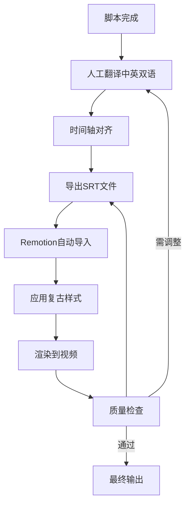
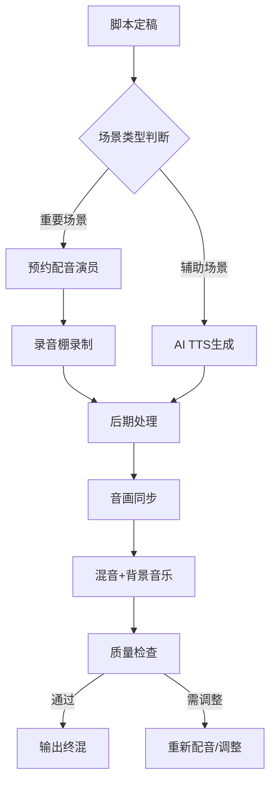

# 字幕与背景音乐补充规划

## 用户需求确认

### 字幕配置

- **语言**: 中英双语字幕
- **样式**: 复古历史感
  - 衬线字体（宋体/Serif）
  - 羊皮纸质感背景
  - 配合历史题材氛围

### 背景音乐

- **风格**: 悬疑紧张
  - 符合《货币战争》原著阴谋论氛围
  - 类似惊悚/政治悬疑片的配乐风格

### 配音方案

- **混合策略**:
  - **重要场景**: 专业配音演员（情感表达丰富）
  - **辅助场景**: AI语音合成（成本效率高）

---

## 字幕系统设计

### 技术实现方案

#### 字幕文件结构

```
subtitle-assets/
├── zh-CN/                 # 中文字幕
│   ├── episode-01.srt     # 第1集字幕
│   ├── episode-02.srt
│   └── ...
├── en-US/                 # 英文字幕
│   ├── episode-01.srt
│   ├── episode-02.srt
│   └── └── ...
└── styles/
    ├── retro-history.css  # 复古历史样式
    └── fonts/
        ├── NotoSerifSC.woff2  # 思源宋体（中文）
        └── Merriweather.woff2  # Merriweather（英文）
```

#### Remotion 字幕组件设计

```typescript
// src/components/subtitles/RetroBilingualSubtitle.tsx

interface RetroBilingualSubtitleProps {
  zhText: string;           // 中文字幕
  enText: string;           // 英文字幕
  startTime: number;        // 开始时间（毫秒）
  endTime: number;          // 结束时间（毫秒）
}

export const RetroBilingualSubtitle: React.FC<RetroBilingualSubtitleProps> = ({
  zhText,
  enText,
  startTime,
  endTime,
}) => {
  return (
    <div style={subtitleContainerStyle}>
      {/* 羊皮纸背景 */}
      <div style={parchmentBackgroundStyle} />

      {/* 中文字幕（上方，大号） */}
      <div style={zhSubtitleStyle}>
        {zhText}
      </div>

      {/* 英文字幕（下方，小号） */}
      <div style={enSubtitleStyle}>
        {enText}
      </div>
    </div>
  );
};
```

#### 复古历史样式规格

```css
/* 字幕容器 */
.subtitle-container {
  position: absolute;
  bottom: 80px;
  left: 50%;
  transform: translateX(-50%);
  width: 80%;
  max-width: 1400px;
  text-align: center;
  z-index: 1000;
}

/* 羊皮纸背景 */
.parchment-background {
  position: absolute;
  top: 0;
  left: 0;
  right: 0;
  bottom: 0;
  background: linear-gradient(
    135deg,
    rgba(222, 184, 135, 0.85) 0%,
    rgba(210, 180, 140, 0.85) 50%,
    rgba(222, 184, 135, 0.85) 100%
  );
  border-radius: 4px;
  box-shadow:
    0 2px 10px rgba(0, 0, 0, 0.5),
    inset 0 0 20px rgba(139, 69, 19, 0.3);
  filter: sepia(0.3);
}

/* 纸张纹理效果 */
.parchment-background::before {
  content: "";
  position: absolute;
  top: 0;
  left: 0;
  right: 0;
  bottom: 0;
  background-image: url("data:image/svg+xml;base64,..."); /* 纸张纹理 */
  opacity: 0.15;
  border-radius: 4px;
}

/* 中文字幕 */
.zh-subtitle {
  position: relative;
  font-family: "Noto Serif SC", "Songti SC", serif;
  font-size: 42px;
  font-weight: 500;
  color: #2c1810;
  text-shadow:
    1px 1px 2px rgba(255, 255, 255, 0.8),
    2px 2px 4px rgba(0, 0, 0, 0.3);
  line-height: 1.6;
  padding: 16px 24px 8px;
  letter-spacing: 2px;
}

/* 英文字幕 */
.en-subtitle {
  position: relative;
  font-family: "Merriweather", "Georgia", serif;
  font-size: 24px;
  font-weight: 400;
  color: #4a3728;
  text-shadow:
    1px 1px 2px rgba(255, 255, 255, 0.6),
    1px 1px 3px rgba(0, 0, 0, 0.2);
  line-height: 1.4;
  padding: 4px 24px 16px;
  font-style: italic;
}
```

### 字幕时间轴示例（第3集：滑铁卢战役）

```
# 第3集：滑铁卢战役 - 信息与金钱的战争

00:00:30,000 --> 00:00:35,000
1815年6月18日，欧洲的命运在滑铁卢定格。
On June 18, 1815, Europe's fate was sealed at Waterloo.

00:00:35,500 --> 00:00:42,000
但真正的战争，并非在战场上打响。
The real war, however, was not fought on the battlefield.

00:00:42,500 --> 00:00:48,000
它发生在伦敦证券交易所，由一个人主导。
It took place in the London Stock Exchange, orchestrated by one man.

00:01:30,000 --> 00:01:38,000
内森·罗斯柴尔德，拥有欧洲最强大的情报网络。
Nathan Rothschild, possessed Europe's most powerful intelligence network.

00:01:38,500 --> 00:01:45,000
当其他人还在等待官方消息时，他已经知道了结果。
While others waited for official news, he already knew the outcome.

00:02:20,000 --> 00:02:28,000
"拿破仑赢了！"——他故意放出假消息。
"Napoleon has won!" — he deliberately spread false news.

00:02:28,500 --> 00:02:35,000
恐慌瞬间席卷伦敦交易所，债券价格暴跌。
Panic instantly swept through London, bond prices plummeted.

00:03:10,000 --> 00:03:18,000
当真相最终公布时，他已经一天内赚了20倍。
When the truth was finally revealed, he had made 20 times the profit in a single day.
```

### 字幕制作工作流



---

## 背景音乐系统设计

### 音乐风格定位：悬疑紧张

#### 情绪曲线设计

```typescript
// 音乐情绪映射表
const MUSIC_MOOD_MAP = {
  // 开场 - 神秘铺垫
  intro: {
    mood: "mystery_buildup",
    tempo: "slow",
    instruments: ["ambient_pad", "subtle_bass", "light_percussion"],
    tension: 3 / 10,
  },

  // 冲突 - 紧张升级
  conflict: {
    mood: "tension_rising",
    tempo: "medium",
    instruments: ["pulsing_bass", "orchestral_hits", "timpani"],
    tension: 7 / 10,
  },

  // 高潮 - 极度紧张
  climax: {
    mood: "suspense_peak",
    tempo: "fast",
    instruments: ["full_orchestra", "brass", "timpani", "strings"],
    tension: 10 / 10,
  },

  // 揭秘 - 震惊
  revelation: {
    mood: "dramatic_impact",
    tempo: "medium_fast",
    instruments: ["brass_hit", "cymbal_crash", "low_bass_drop"],
    tension: 9 / 10,
  },

  // 后果 - 压抑沉重
  aftermath: {
    mood: "somber_realization",
    tempo: "slow",
    instruments: ["low_strings", "ambient_drone", "minimal_piano"],
    tension: 6 / 10,
  },
};
```

### 分集音乐规划

#### 第1集：货币的本质

| 时间段      | 场景              | 音乐风格     | 参考曲目                        |
| ----------- | ----------------- | ------------ | ------------------------------- |
| 00:00-01:00 | 开场 - 黄金与白银 | 神秘氛围铺垫 | Hans Zimmer - Interstellar主题  |
| 01:00-03:00 | 纸币的诞生        | 渐进紧张     | The Social Network配乐          |
| 03:00-05:00 | 债务货币系统      | 压抑低沉     | Dark Knight - "Why So Serious?" |
| 05:00-06:00 | 总结与悬念        | 铺垫下一集   | Inception - "BRAHMS"            |

#### 第3集：滑铁卢战役（重点集数）

| 时间段      | 场景             | 音乐风格   | 情绪强度                    |
| ----------- | ---------------- | ---------- | --------------------------- |
| 00:00-01:30 | 战场画面         | 史诗战争感 | 9/10 - Glory-like           |
| 01:30-02:30 | 罗斯柴尔德情报网 | 悬疑紧张   | 7/10 - Mission Impossible   |
| 02:30-03:30 | 交易所假消息     | 混乱恐慌   | 8/10 - Black Monday         |
| 03:30-05:00 | 真相大白-暴利    | 戏剧性高潮 | 10/10 - The Big Short       |
| 05:00-06:00 | 历史影响         | 压抑沉重   | 6/10 - Shawshank Redemption |

### 音乐库构建

#### 免费音乐资源

```
audio-assets/music/
├── mystery_tension/          # 悬疑紧张类
│   ├── slow_buildup/         # 缓慢铺垫
│   ├── medium_tension/       # 中度紧张
│   └── high_suspense/        # 高度悬疑
├── orchestral_epic/          # 史诗交响
│   ├── battle_scenes/        # 战争场景
│   └── dramatic_peaks/       # 戏剧高潮
└── ambient_atmosphere/       # 氛围音乐
    ├── historical/           # 历史感
    └── somber/               # 沉重压抑
```

#### 推荐音乐库（免版权）

1. **Epidemic Sound** - 订阅制，高质量悬疑配乐
2. **Artlist** - 电影级配乐库
3. **Free Music Archive** - 免费音乐，需筛选
4. **ccMixter** - CC授权，混音友好
5. **YouTube Audio Library** - 免费，需标注

### AI 音乐生成方案

使用 AI 工具生成原创音乐（避免版权问题）：

```typescript
// 音乐生成参数配置
const AI_MUSIC_GENERATION = {
  platform: "Suno AI / Udio / AIVA",

  prompts: {
    // 悬疑紧张
    suspense: `
      Genre: Cinematic Suspense, Tension Building
      Mood: Mysterious, ominous, conspiratorial
      Tempo: 60-80 BPM (slow build), 120-140 BPM (climax)
      Instruments: Deep bass drones, pulsing synths, orchestral hits,
                   sparse piano, ticking clock elements
      Reference: Hans Zimmer, John Carpenter
      Duration: 2-3 minutes loops
      Key: D minor, C minor
    `,

    // 史诗高潮
    epic: `
      Genre: Orchestral Epic, Dramatic
      Mood: Powerful, impactful, historical significance
      Tempo: 90-110 BPM
      Instruments: Full orchestra, brass section, timpani,
                   soaring strings, choir
      Reference: Hans Zimmer, Two Steps From Hell
      Duration: 3-5 minutes
      Key: D minor, E minor
    `,

    // 压抑沉重
    somber: `
      Genre: Ambient Drone, Dark Atmosphere
      Mood: Oppressive, heavy, consequences
      Tempo: 40-60 BPM
      Instruments: Low frequency drones, sub-bass,
                   minimal piano, ambient textures
      Reference: Interstellar, The Revenant
      Duration: 2-3 minutes
      Key: C minor, D minor
    `,
  },
};
```

---

## 配音系统设计

### 混合配音策略

#### 真人配音场景（专业配音演员）

**优先级场景**（情感要求高）：

1. **第3集：滑铁卢战役**
   - 旁白开场："1815年，欧洲的命运..."
   - 内森·罗斯柴尔德的独白
   - 交易所恐慌描述

2. **第7集：杰基尔岛阴谋**
   - 神秘开场旁白
   - 银行家密谋对话（多角色）

3. **第9集：1929大萧条**
   - 股市崩溃时的紧张旁白
   - 人群恐慌描述

**配音要求**：

- 中文：成熟男声，类似纪录片旁白（参考《大国崛起》）
- 英文：地道口音，符合角色背景（罗斯柴尔德用德式英语）

#### AI 合成场景（辅助场景）

**适合场景**（信息密集、情感要求低）：

- 历史数据陈述
- 年表叙述
- 次要角色对话
- 背景说明

**AI 工具选择**：

```
推荐工具：
├── Azure TTS（微软）        # 中文最佳
│   └── 声音：zh-CN-XiaoxiaoNeural（女）、zh-CN-YunyangNeural（男）
├── ElevenLabs               # 英文最佳，情感丰富
│   └── 声音：Adam（叙事）、Marcus（严肃）
└── OpenAI TTS               # 备选，性价比高
    └── 声音：alloy（中性）、onyx（深沉）
```

### 配音工作流

```typescript
// 配音脚本格式
interface VoiceoverScript {
  episode: number;
  scene: string;
  duration: number; // 时长（秒）

  lines: VoiceoverLine[];
}

interface VoiceoverLine {
  id: string;

  // 中文配音
  zhText: string;
  zhVoiceType: "human" | "ai";
  zhVoiceActor?: string; // 真人配音演员
  zhAiModel?: string; // AI模型

  // 英文配音（可选）
  enText?: string;
  enVoiceType?: "human" | "ai";
  enVoiceActor?: string;

  // 技术参数
  startTime: number; // 开始时间
  duration: number; // 持续时间
  emotion: "neutral" | "tense" | "dramatic" | "somber";
}
```

### 配音制作流程



---

## 混音与音效设计

### 音效库

```
audio-assets/sfx/
├── historical/              # 历史场景音效
│   ├── battle_war/          # 战争音效
│   │   ├── cannon_fire.wav
│   │   ├── musket_shots.wav
│   │   └── cavalry_charges.wav
│   ├── stock_exchange/      # 交易所音效
│   │   ├── ticker_tape.wav
│   │   ├── shouting_crowd.wav
│   │   └── bell_ringing.wav
│   └── period_ambience/     # 时代氛围
│       ├── horse_carriage.wav
│       ├── printing_press.wav
│       └── pen_on_paper.wav
├── ui_sounds/               # UI音效
│   ├── text_reveal.wav      # 字幕逐字出现
│   ├── transition_whoosh.wav
│   └── impact_hit.wav
└── atmospheric/             # 氛围音效
    ├── wind_outdoors.wav
    ├── rain_thunderstorm.wav
    └── clock_tickling.wav
```

### 混音层次结构

```typescript
// 音频层级配置
const AUDIO_MIX_LAYERS = {
  // 第1层：对白（最重要）
  dialogue: {
    volume: 1.0, // 100%
    priority: "highest",
    ducking: {
      // 侧链压缩
      music: 0.3, // 音乐降低到30%
      sfx: 0.5, // 音效降低到50%
    },
  },

  // 第2层：字幕音效（UI）
  subtitle_fx: {
    volume: 0.6, // 60%
    priority: "high",
    ducking: {
      music: 0.8,
      sfx: 0.9,
    },
  },

  // 第3层：背景音乐
  music: {
    volume: 0.5, // 50%
    priority: "medium",
    fade: {
      in: 1000, // 淡入1秒
      out: 2000, // 淡出2秒
    },
  },

  // 第4层：环境音效
  ambience: {
    volume: 0.3, // 30%
    priority: "low",
    loop: true,
  },
};
```

---

## 实施时间表（补充）

### 第10周：音频后期制作

| 任务              | 时长 | 负责人          |
| ----------------- | ---- | --------------- |
| 配音录制（真人）  | 3天  | 专业配音演员    |
| AI配音生成        | 1天  | 音频工程师      |
| 背景音乐制作/采购 | 2天  | 作曲师/音乐编辑 |
| 音效库整理        | 1天  | 音效设计师      |
| 混音与终混        | 2天  | 混音师          |

---

## 预算补充

### 音频制作成本估算

| 项目                         | 单价      | 数量  | 小计           |
| ---------------------------- | --------- | ----- | -------------- |
| **配音**                     |           |       |                |
| 专业配音演员（中文）         | ¥800/小时 | 8小时 | ¥6,400         |
| 专业配音演员（英文）         | $150/小时 | 4小时 | $600 (≈¥4,200) |
| AI TTS（Azure/ElevenLabs）   | ¥200/月   | 1月   | ¥200           |
| **音乐**                     |           |       |                |
| 音乐库订阅（Epidemic Sound） | $15/月    | 2月   | $30 (≈¥210)    |
| AI音乐生成（Suno/Udio）      | ¥300/月   | 1月   | ¥300           |
| 免费音乐（CC0）              | ¥0        | -     | ¥0             |
| **音效**                     |           |       |                |
| 音效库购买（一次性）         | ¥500      | -     | ¥500           |
| **后期制作**                 |           |       |                |
| 混音师                       | ¥600/天   | 3天   | ¥1,800         |
| **总计**                     |           |       | **≈¥13,610**   |

---

## 技术实现要点

### Remotion 音频集成

```typescript
// src/compositions/Episode3.tsx

import {useCurrentFrame, useVideoConfig, Audio} from 'remotion';
import {RetroBilingualSubtitle} from '../components/subtitles';

export const Episode3 = () => {
  return (
    <>
      {/* 背景音乐 - 悬疑紧张 */}
      <Audio
        src="audio-assets/music/suspense/waterloo_main_theme.mp3"
        volume={0.5}
      />

      {/* 对白 - 第3集开场 */}
      <Audio
        src="audio-assets/voiceover/ep3/ep3_opening_zh.mp3"
        volume={1.0}
      />

      {/* 音效 - 战场炮火 */}
      <Audio
        src="audio-assets/sfx/battle_war/cannon_fire.mp3"
        volume={0.3}
        startFrom={10} // 10秒后开始
      />

      {/* 字幕组件 */}
      <RetroBilingualSubtitle
        zhText="1815年6月18日，欧洲的命运在滑铁卢定格。"
        enText="On June 18, 1815, Europe's fate was sealed at Waterloo."
        startTime={500}
        endTime={5500}
      />

      {/* 画面内容... */}
      <BattleOfWaterlooScene />
    </>
  );
};
```

### 字幕自动导入工具

```typescript
// scripts/import-subtitles.ts

import { readFileSync, writeFileSync } from "fs";
import { parse } from "srt-parser-2";

// 从SRT文件导入字幕
function importSubtitles(srtPath: string) {
  const srtContent = readFileSync(srtPath, "utf-8");
  const subtitles = parse(srtContent);

  return subtitles.map((sub) => ({
    startTime: sub.startTime / 1000, // 转换为秒
    endTime: sub.endTime / 1000,
    zhText: sub.text,
    enText: sub.text, // 需要从英文字幕文件匹配
  }));
}

// 生成Remotion可用的JSON
function generateSubtitleJson(episodes: number[]) {
  episodes.forEach((ep) => {
    const zhSubs = importSubtitles(`subtitle-assets/zh-CN/episode-${ep}.srt`);
    const enSubs = importSubtitles(`subtitle-assets/en-US/episode-${ep}.srt`);

    // 合并中英字幕
    const bilingualSubs = zhSubs.map((zh, i) => ({
      ...zh,
      enText: enSubs[i]?.text || "",
    }));

    writeFileSync(
      `public/subtitles/episode-${ep}.json`,
      JSON.stringify(bilingualSubs, null, 2),
    );
  });
}
```

---

## 质量保证

### 字幕质量检查清单

- [ ] 中英文翻译准确无误
- [ ] 时间轴与语音完全同步
- [ ] 复古样式应用正确（衬线字体、羊皮纸背景）
- [ ] 字幕长度不超过屏幕宽度80%
- [ ] 字幕不遮挡关键画面内容
- [ ] 逐字显示动画流畅自然
- [ ] 所有专有名词翻译一致（Rothschild、Federal Reserve等）

### 音频质量检查清单

- [ ] 对白清晰可懂，无杂音
- [ ] 背景音乐不干扰对白（侧链压缩正确）
- [ ] 音效使用恰当，增强氛围
- [ ] 音量平衡一致（无突大突小）
- [ ] 无版权问题（音乐和音效均为授权或原创）
- [ ] AI合成语音自然度可接受
- [ ] 真人配音情感表达到位

---

## 下一步行动

您现在可以选择：

1. **✅ 确认方案** - 补充到现有工作计划中
2. **📝 调整细节** - 修改字幕样式、音乐风格等
3. **🚀 开始实施** - 初始化项目，开始制作
4. **🎵 先做音频Demo** - 制作一个示例场景的音频样片
